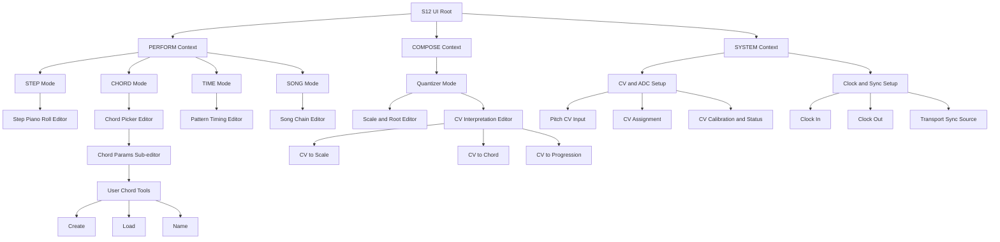
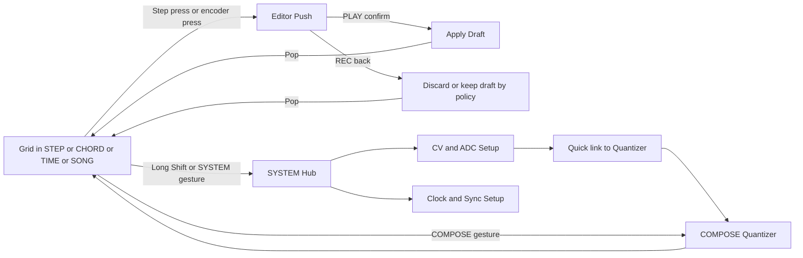

# S12 UI Workflow Hierarchy Proposal (Issue #35)

This document defines a modular UI operating model for S12 that can scale to ADC/CV input workflows and quantizer behavior without turning the current screen system into tightly coupled mode logic.

The goal is architectural definition, not a full rewrite.

## 1) Current Screen Inventory (As Implemented)

Current runtime UI modes are centralized in `ui/ui_sequencer.c`:

- Grid
- Step Piano Roll
- Chord Menu
- Chord Params
- Timing Menu
- Song Chain
- User Chord Menu
- User Chord Create
- User Chord Load
- User Chord Name

Reusable screen module lifecycle already exists via `UiScreen` (`on_enter`, `on_update`, `on_input`, `on_draw`, `on_exit`) in `ui/screens/ui_screen_base.h`.

Region ownership primitives already exist in `ui/ui_regions.h` and per-screen render plans are present in current screen modules.

## 2) Proposed UI Hierarchy Tree

Top-level should be "contexts" (performance domains), with editors below them.

### Top-level mode rule

- Top-level contexts: PERFORM, COMPOSE, SYSTEM.
- Top-level performance modes: STEP, CHORD, TIME, SONG.
- Quantizer should be top-level under COMPOSE, not buried in a single editor.
- CV setup and clock setup belong under SYSTEM.

## 3) Navigation Flow

Current Shift-tap mode cycling can remain, but should cycle performance domains only. Deep editors should use a screen stack.

### Navigation contract

- Global layer:
  - Shift tap: cycle STEP, CHORD, TIME, SONG only.
  - Dedicated gesture to open SYSTEM hub.
  - Dedicated gesture to open COMPOSE Quantizer.
- Screen stack:
  - Push editor on enter.
  - Pop to parent on REC.
  - Confirm on PLAY.

## 4) Screen Ownership Model

Each screen owns:

- Local state container.
- Input interpretation while active.
- Draw regions it is allowed to modify.
- Draft data before commit.

Shared global state is limited to:

- Transport read-only status (except transport control actions).
- Persistent composition model accessed through bridge APIs.
- UI routing stack and current context token.

Must not be shared implicitly:

- Cached footer selections across unrelated screens.
- Header assumptions (title/status) between screens.
- Draw calls that touch foreign regions.

## 5) Lifecycle Model

Use and enforce this lifecycle for every screen:

1. Enter:
   - Bind immutable context (step index, pattern index, source mode).
   - Reset per-screen transient state.
   - Declare owned regions and initial dirty flags.
2. Update:
   - Process timers/blink only for owned visuals.
   - Pull read-only runtime status as needed.
3. Input:
   - Consume only mapped events for this screen.
   - Return unhandled events to router.
4. Draw:
   - Draw only owned regions.
   - Use incremental redraw first; full redraw only when invalidated.
5. Exit:
   - Emit explicit exit reason (back, save, discard).
   - Commit or rollback draft state based on policy.

Recommended additions:

- Optional `on_suspend` and `on_resume` for modal overlays.
- Router-managed screen stack: root performance screen + pushed editors.

## 6) Current Coupling Problems (Observed)

1. Mode logic and screen logic are mixed in one large coordinator (`ui/ui_sequencer.c`), so adding new workflows increases branching risk.
2. Several non-screen flows call display functions directly instead of always routing through active screen lifecycle.
3. Input dispatch is partly table-driven and partly branch-driven, creating behavior drift risk as modes grow.
4. Some screen transitions mutate both UI mode and business state in one step, making rollback policies unclear.
5. Footer/header state caching lives in shared display space and can leak assumptions between screens.
6. Grid-only transport handling is clear today, but future SYSTEM/COMPOSE overlays will need explicit global action policy.

## 7) Piano Roll as Reference Ownership Model

Use Step Piano Roll as the reference for future screen isolation:

- It has bounded redraw behavior.
- It treats rows as owned draw units.
- It avoids accidental redraw dependencies on unrelated menu frames.

Adopt this pattern for all new editors:

- Explicit region map.
- Strict local draw cache.
- No writes outside owned regions.

## 8) ADC/CV Setup Placement

Place ADC/CV setup under SYSTEM context:

- CV Input Overview screen (signal present, calibrated, assigned target).
- Pitch CV Input screen (activation mode and behavior).
- CV Assignment screen (route input to quantizer source, root tracking, transpose, progression steer).
- CV Calibration/Status screen (raw value, filtered value, stability, calibration validity).

This keeps hardware/control concerns out of performance editors while still allowing quick links back to musical workflows.

## 9) Pitch CV Activation Proposal

Pitch CV activation should support both automatic and manual entry.

### Activation states

- Detached: no cable or no stable signal.
- Detected: signal stable, offer action banner.
- Armed: user accepted CV workflow or enabled always-on.
- Active: CV is currently driving selected quantizer interpretation path.

### Entry paths

- Automatic prompt:
  - On stable CV detect, show non-blocking prompt in status region.
  - PLAY enters Quantizer quick setup.
- Manual path:
  - SYSTEM -> CV Input Overview -> Pitch CV Input -> Enable.
- In-mode quick action:
  - In STEP/CHORD/TIME/SONG, shortcut opens Quantizer with current mode context.

## 10) Quantizer Mode Placement and State Integration

Quantizer belongs under COMPOSE context, with hooks into current song and chord state.

### Quantizer state layers

- Global quantizer config:
  - enabled
  - interpretation mode (cv_to_scale, cv_to_chord, cv_to_progression)
  - default root and scale
- Pattern-level overrides:
  - optional root/scale override per pattern.
- Step-level modifiers:
  - allow or block quantizer influence per step.

### Relationship to composition state

- Scale/root defaults should come from song key when no override is active.
- Chord-aware mode should quantise toward active step chord tones.
- Progression-aware mode should consider chain position and current pattern context.
- Transport state gates interpretation windows where needed (for deterministic updates at musical boundaries).

## 11) Safe Modularization Order

1. Freeze current behavior with a UI route test checklist.
2. Introduce router stack abstraction without changing visible behavior.
3. Convert existing direct-display transition paths into screen push/pop transitions.
4. Separate global input actions from screen-local input handlers.
5. Add SYSTEM hub shell (placeholder screens).
6. Add CV Input Overview and Pitch CV activation state machine.
7. Add COMPOSE Quantizer shell and read-only state view.
8. Add editable scale/root and interpretation mapping.
9. Connect quantizer outputs to step/chord/progression contexts behind feature flags.
10. Remove obsolete branch-based routing once all workflows use the same lifecycle path.

## 12) Concrete Next Implementation Targets

Short-term, low-risk changes to begin now:

- Introduce a `UiScreenId` and a small screen stack in the UI router.
- Define explicit shared context structs:
  - `UiSessionContext`
  - `UiComposeContext`
  - `UiSystemContext`
- Add placeholder screens:
  - SYSTEM hub
  - CV Input Overview
  - Quantizer Home
- Keep existing visual behavior unchanged for STEP/CHORD/TIME/SONG while integrating the new routing skeleton.

This sequence preserves deterministic runtime behavior while opening architecture space for ADC/CV and quantizer workflows.